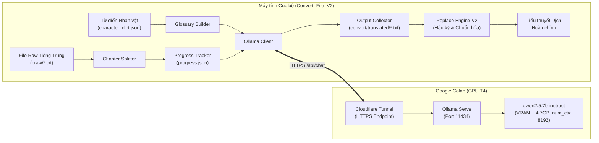

# Tài liệu Thiết kế Kỹ thuật: Hệ thống Dịch thuật Tiểu thuyết Raw bằng Ollama (Qwen2.5) qua Google Colab

**Ngày tạo:** 2026-10-03  
**Tác giả:** AI Coding Assistant & User  
**Dự án:** Convert_File_V2  
**Mục tiêu:** Xây dựng hệ thống tự động dịch tiểu thuyết raw tiếng Trung sang tiếng Việt chất lượng cao bằng mô hình ngôn ngữ lớn `qwen2.5:7b-instruct` chạy trên máy chủ Google Colab GPU T4, kết nối an toàn với máy tính cục bộ qua Cloudflare Tunnel, hỗ trợ tách chương thông minh, ép từ điển nhân vật (Glossary), checkpoint tiến độ chống mất mát dữ liệu và hậu kỳ tự động bằng Replace Engine.

---

## 1. Kiến trúc Hệ thống Tổng thể

Hệ thống được thiết kế theo mô hình Client-Server phân tán:
- **Server (Cloud Host):** Chạy trên Google Colab với GPU NVIDIA T4 (16GB VRAM), phục vụ mô hình `qwen2.5:7b-instruct` qua `ollama` và mở cổng HTTPS công khai bằng `cloudflared tunnel`.
- **Client (Local Machine):** Chạy trên máy Windows trong dự án `Convert_File_V2`, chịu trách nhiệm phân tích văn bản raw, quản lý tiến độ, nhúng từ điển nhân vật theo ngữ cảnh từng chương, gửi yêu cầu dịch thuật và hậu kỳ bản dịch.



---

## 2. Các Module Chi tiết

### 2.1. Phân đoạn chương (`src/translator/chapter_splitter.py`)
- **Nhiệm vụ:** Đọc file raw tiếng Trung và chia thành danh sách các chương có cấu trúc hoàn chỉnh.
- **Quy tắc nhận diện tiêu đề chương:**
  - Tiêu đề chữ Hán: `r'^\s*(?:第\s*[0-9一二三四五六七八九十百千万]+\s*[章卷回节]|===|\d+[\.\s]+).*'`
  - Tiêu đề phụ hoặc số thứ tự: Hỗ trợ các file gộp nhiều chương (như `=== 001-010 ===`).
- **Cấu trúc dữ liệu:**
  ```python
  @dataclass
  class Chapter:
      index: int
      title: str
      content: str
      char_count: int
  ```
- **Xử lý chương quá dài:** Nếu một chương vượt quá 4,000 ký tự tiếng Trung, module sẽ chia nhỏ thành các sub-chunks (2,000 - 2,500 ký tự) theo dấu ngắt đoạn `\n\n` để đảm bảo Qwen 2.5 không bị suy giảm chất lượng dịch.

### 2.2. Trích xuất Glossary theo ngữ cảnh (`src/translator/glossary_builder.py`)
- **Nhiệm vụ:** Nạp từ điển `resources/dictionaries/character_dict.json` và `resources/dictionaries/common_dict.json`.
- **Tối ưu hóa Prompt:** Đối với mỗi chương, chỉ lọc các từ khóa thực sự xuất hiện trong nội dung chương đó để nhúng vào Prompt. Điều này tránh việc nhồi nhét hàng nghìn tên nhân vật làm loãng sự tập trung của mô hình AI.
- **Định dạng nhúng:**
  ```text
  DANH SÁCH TÊN NHÂN VẬT & THUẬT NGỮ BẮT BUỘC DỊCH CHUẨN XÁC:
  - 龙剑飞 => Long Kiếm Phi
  - 沈倩影 => Thẩm Thiến Ảnh
  - 炎河 => Sông Viêm (Giang Viêm)
  ```

### 2.3. Khách hàng API Ollama (`src/translator/ollama_client.py`)
- **Nhiệm vụ:** Giao tiếp với Ollama server trên Google Colab qua endpoint `/api/chat`.
- **Health Check:** Kiểm tra endpoint `/api/tags` trước khi bắt đầu dịch để xác nhận server đang hoạt động và model `qwen2.5:7b-instruct` đã sẵn sàng.
- **Tham số sinh:**
  - `temperature: 0.2` (giảm thiểu ảo giác, dịch sát nguyên tác).
  - `num_ctx: 8192` (đảm bảo đủ không gian cho cả chương và bản dịch).
  - `top_p: 0.9`.
- **Cơ chế chịu lỗi:** Thử lại 3 lần với khoảng chờ tăng dần (Exponential backoff) khi gặp lỗi mạng, timeout (180 giây/chương), hoặc rate limit.

### 2.4. Quản lý tiến độ Checkpoint (`src/translator/progress_tracker.py`)
- **Nhiệm vụ:** Đảm bảo quá trình dịch có thể tạm dừng hoặc khôi phục bất kỳ lúc nào mà không bị mất dữ liệu đã dịch.
- **Cơ chế:**
  - Lưu trạng thái vào file `convert/progress_<tên_file>.json`:
    ```json
    {
      "input_file": "craw/shao_long_feng_liu_raw.txt",
      "total_chapters": 309,
      "completed_chapters": [1, 2, 3],
      "last_completed_index": 3,
      "output_file": "convert/translated/shao_long_feng_liu_vietnamese.txt",
      "last_updated": "2026-10-03T21:15:00"
    }
    ```
  - Khi bắt đầu phiên dịch mới: Nếu phát hiện file tiến độ cũ, hệ thống tự động nhảy qua các chương đã hoàn thành và dịch tiếp từ chương tiếp theo.
  - File kết quả `.txt` được mở ở chế độ append (`"a"`), ghi đĩa và flush ngay sau mỗi chương hoàn tất.

### 2.5. Trích xuất & Bồi đắp Từ điển Động (Dynamic Dictionary Extraction & Curation)
- **Nhiệm vụ:** Trong khi dịch từng chương, yêu cầu Qwen 2.5 đồng thời trích xuất danh sách các thực thể / từ vựng Hán Việt mới (Tên người, Tông môn, Địa danh, Thành ngữ 4 chữ, Công pháp, Cảnh giới).
- **Cấu trúc phản hồi phân tách:**
  ```text
  === BẢN DỊCH ===
  (Nội dung tiếng Việt mượt mà của chương)

  === TỪ ĐIỂN MỚI ===
  - 龙剑飞 => Long Kiếm Phi (Loại: Nhân vật)
  - 稷下村 => Tắc Hạ thôn (Loại: Địa danh)
  - 炎河 => Sông Viêm (Loại: Địa danh)
  - 子欲养而亲不待 => Tử dục dưỡng nhi thân bất đãi (Loại: Thành ngữ)
  ```
- **Xử lý lưu trữ:**
  - Tự động lọc các từ đã có trong `character_dict.json` và `common_dict.json` để tránh trùng lặp.
  - Phân loại:
    - Loại `Nhân vật` -> Tự động nạp hoặc gợi ý vào `resources/dictionaries/character_dict.json`.
    - Loại `Địa danh`, `Thành ngữ`, `Công pháp` -> Nạp vào `resources/dictionaries/common_dict.json`.
  - Tự động ghi vào file gợi ý `samples/suggested_terms.json` để theo dõi và hỗ trợ duyệt nhanh bằng `src/importer/main.py`.

### 2.6. Hậu kỳ tự động (Post-processing Integration)
- Sau khi toàn bộ các chương đã chọn được dịch xong, hệ thống tự động gọi `ReplaceEngine` (`src/replacer/replace_engine.py`) để:
  - Đồng bộ chuẩn hóa chữ hoa các tên riêng.
  - Sửa các hạt sạn cú pháp hoặc từ nối lặp lại.
  - Áp dụng các luật khôi phục từ `deconvert_dict.json` để triệt tiêu mọi tên dị dạng.
  - Xuất ra file kết quả cuối cùng hoàn thiện tại `convert/translated/`.

---

## 3. Tích hợp Giao diện Điều khiển (CLI Menu)

Cập nhật `run_cli.py` với tùy chọn mới:
```text
  [ QUY TRÌNH DỊCH THUẬT AI (OLLAMA / COLAB) ]
  [15] 🌐 Dịch tiểu thuyết raw bằng Ollama Qwen2.5 (Colab Server)
```

Quy trình tương tác khi chọn [15]:
1. Nhập URL Colab Cloudflare (`https://...trycloudflare.com`).
2. Tự động kiểm tra kết nối tới Colab.
3. Chọn file raw tiếng Trung đầu vào (mặc định gợi ý trong `craw/` hoặc `samples/`).
4. Tùy chọn phạm vi dịch:
   - Dịch toàn bộ truyện từ vị trí dang dở (Checkpoint).
   - Dịch thử nghiệm một số chương (ví dụ: từ chương 1 đến chương 5).
5. Hiển thị tiến trình dịch từng chương, thời gian xử lý và tốc độ dịch (giây/chương).
6. Tự động chạy hậu kỳ làm sạch văn bản bằng `ReplaceEngine`.

---

## 4. Kịch bản Google Colab đính kèm (`tools/colab_ollama_server.ipynb`)

Cung cấp sẵn file notebook Google Colab chuẩn:
1. `!curl -fsSL https://ollama.com/install.sh | sh`
2. `!wget -q https://github.com/cloudflare/cloudflared/releases/latest/download/cloudflared-linux-amd64.deb && dpkg -i cloudflared-linux-amd64.deb`
3. Chạy `ollama serve` ở chế độ nền.
4. Chạy `ollama pull qwen2.5:7b-instruct`.
5. Chạy `cloudflared tunnel --url http://localhost:11434` và tự động in ra URL public để copy về local.

---

## 5. Chiến lược Kiểm thử (Testing Strategy)

1. **Unit Tests:**
   - `tests/test_chapter_splitter.py`: Kiểm thử khả năng nhận diện tiêu đề chương tiếng Trung, phân đoạn và xử lý các trường hợp tiêu đề bất thường.
   - `tests/test_glossary_builder.py`: Kiểm thử việc trích xuất đúng tập hợp tên nhân vật có trong văn bản chương.
   - `tests/test_translator_progress.py`: Kiểm thử ghi checkpoint, resume tiến độ và khôi phục khi gặp lỗi.
2. **Integration Test (Mocked API):**
   - Mock endpoint Ollama để kiểm tra luồng hoàn chỉnh từ Chapter Splitter -> Glossary Builder -> Ollama Client -> Progress Tracker -> Output File.
